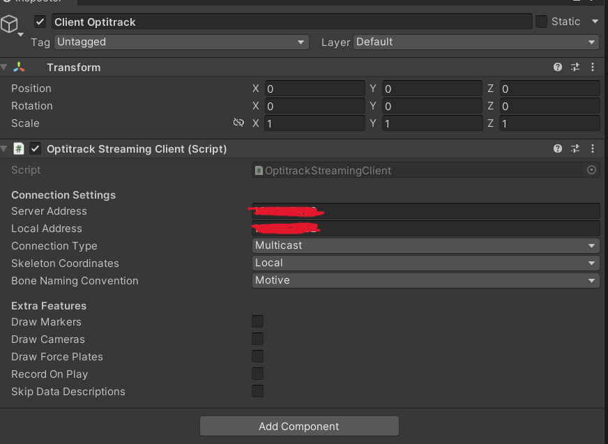
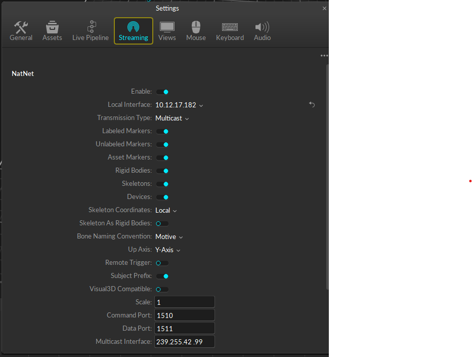
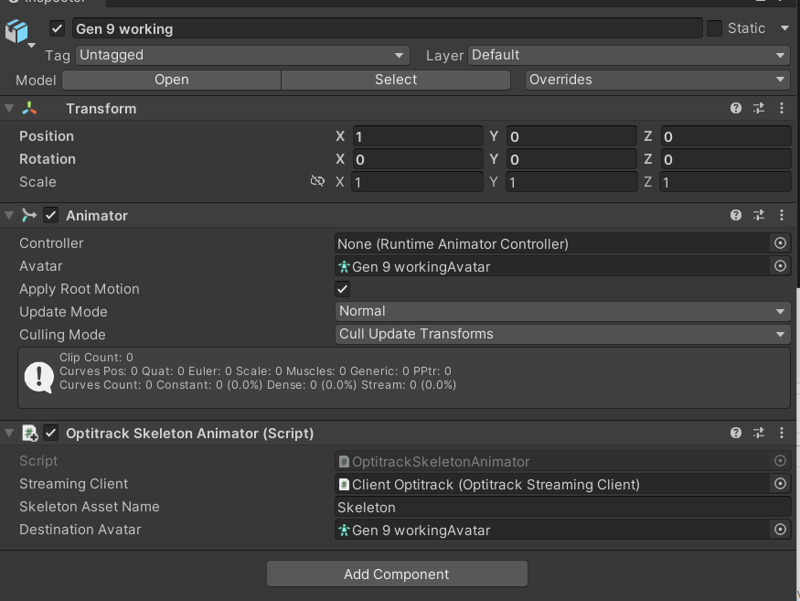
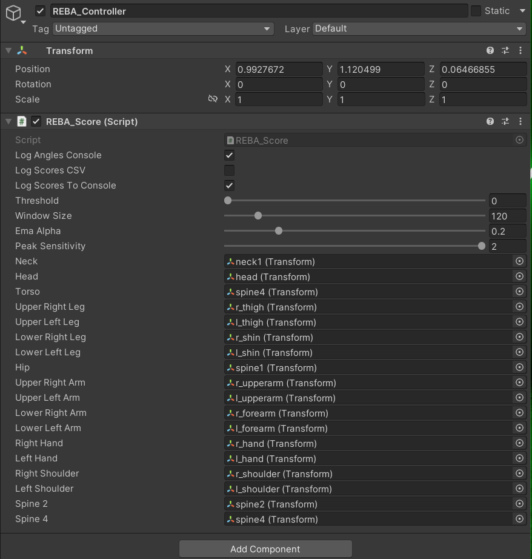

In der Computation und Visualization Gruppe konzentrieren wir uns auf die Berechnung des so genannten REBA-Scores. Die Rapid Entire Body Assessment (REBA) ist eine Methode zur Bewertung der Körperhaltung und Bewegung.
Sie wurde entwickelt, um das Risiko von Muskel-Skelett-Erkrankungen bei der Arbeit zu bewerten. Die Methode basiert auf der Beobachtung der Körperhaltung, der Bewegung, der Kraftanforderungen und der Muskelaktivität.

Die REBA-Methode besteht aus zwei Teilen: dem oberen und dem unteren Körper. Jeder Teil wird separat bewertet und dann zusammengezählt, um das Gesamtrisiko zu ermitteln. Die Bewertungsskala reicht von 1 (geringes Risiko) bis 15 (sehr hohes Risiko).
Wir nutzen also die Winkel zwischen den Gliedmaßen um zu bestimmen, ob die Nutzer eines VR-Headsets eine Risikobehaftete Körperhaltung haben und melden dies mit Hilfe der Arbeit der Multimodal Feedback den Nutzern durch visuelles, auditives und vibrationsbasiertes Feedback ihnen in Echzeit zurück.

Figure 1:

   
  
   
  Figure 1: Inspector of the Optitrack Controller

The Optitrack_Client, which holds the Optitrack Straming Client Script, is used for the communication between Unity and Motive. Before the Application is started the Server and Client credentials must be updated to the corresponding IP-Addresses, which can be seen in the Motive settings in Figure 2.

Figure 2:

   
  
   
  Figure 2: Settings in Motive 

The Optitrack Skeleton Animator Skript needs to be attached to the Avatar Game Object. The "Skeleton Asset Name" has to be the same name as it is in Motive. DAZ-Studio 3D Avatar is used, which needs to be configured as humanoid, thus the mapping needs to be draged into the "Destination Avatar" space. 

Figure 3:

   
  
   
  Figure 3: Avatar Game Object 

Figure 4:

   
  
   
  Figure 4: Reba-Controller

If you want to log the limb scores and the corresponding table scores into a csv-file you need to tick the "Log Scores CSV" box. Further  
Beitragende:

    Frederik Wiemer
    Jonas
    Luke Werle
