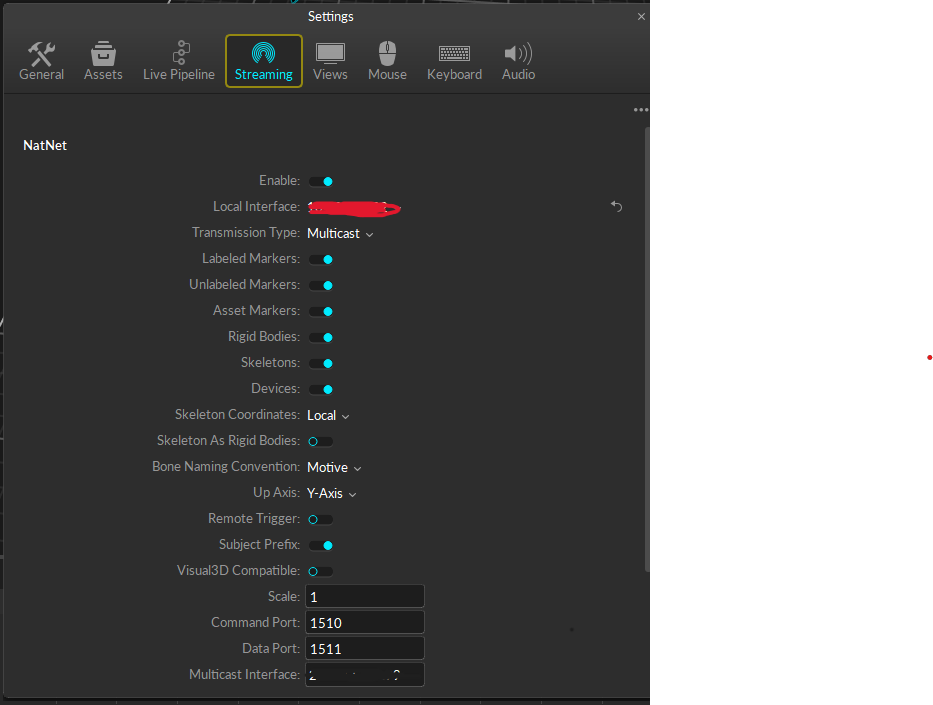

# AutoREBA - Computation & Visualization

## Overview:
In the Computation and Visualization group, we focus on calculating the so-called REBA score. The Rapid Entire Body Assessment (REBA) is a method for evaluating body posture and movement. It was developed to assess the risk of musculoskeletal disorders at work. The method is based on observing body posture, movement, force requirements, and muscle activity.

The REBA method consists of two parts: the upper and lower body. Each part is evaluated separately and then added together to determine the overall risk. The assessment scale ranges from 1 (low risk) to 15 (very high risk). Therefore, we use the angles between the limbs to determine whether users of a VR headset have a risky posture and report this to the users in real-time using the work of the Multimodal Feedback through visual, auditory, and vibration-based feedback.

Figure 1:

   
  
   
  Figure 1: Inspector of the Optitrack Controller

The Optitrack_Client, which holds the Optitrack Straming Client Script, is used for the communication between Unity and Motive. Before the Application is started the Server and Client credentials must be updated to the corresponding IP-Addresses, which can be seen in the Motive settings in Figure 2.

Figure 2:

   
  
   
  Figure 2: Settings in Motive 

The Optitrack Skeleton Animator Skript needs to be attached to the Avatar Game Object. The "Skeleton Asset Name" has to be the same name as it is in Motive. DAZ-Studio 3D Avatar is used, which needs to be configured as humanoid, thus the mapping needs to be draged into the "Destination Avatar" space. 

Figure 3:

   
  
   
  Figure 3: Avatar Game Object 

Figure 4:

   
  
   
  Figure 4: Reba-Controller

If you want to log the limb scores and the corresponding table scores into a csv-file you need to tick the "Log Scores CSV" box. The CSV Log File is saved in %PojectFile%/Logs/AutoREBALogFile.csv. Furthermore there are the options to print the angles and/or scores into the console. The "threshold" variable is used to determin at which angle a limb is considered twisted, sided or bend. The "Window Size" determines how large the rolling window is supposed to be, i.e. how many frames are onsidered in the averiging of the score.

## Contributors:

- [Jonas Scheffner](https://github.com/jonasscheffner)
- [Luke Werle](https://github.com/Luke-Werle-99)
- [Frederik Wiemer](http://github.com/FreddyOs)
