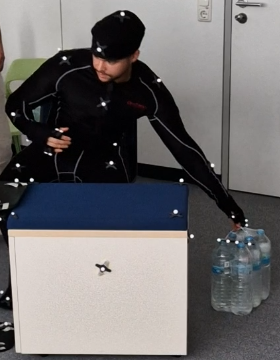

# AutoREBA - Ground Truth

## Overview:
In order to assess the individual body parts and their respective scores we used the official ErgoPlus’ website and PDF document “A Step-by-Step Guide to the REBA Assessment Tool” 
This included explanations, pictures and the tables used to determine the scores that make up the final REBA score. 

   
  
   
  Figure 1: REBA Overview, Source: https://ergo-plus.com/reba-assessment-tool-guide/

As the website outlines, we took multiple pictures and videos to assess the posture accurately. 
Firstly we took videos from two different angles from which we took screenshots and noted down their timestamps within the video. 
Additionally we used Motive, a motion capture program with which we could track the target's movement precisely and from multiple angles at once. To achieve this the person to be measured needed to wear a full body suit with reflective knobs that the setup cameras around the room could recognise. The accurate position of the knobs on the person was of great importance due to the program needing this precision to better follow the person's movement. 

## The REBA Score:

The Rapid Entire Body Assessment (REBA) was developed to “rapidly” evaluate risk of musculoskeletal disorders (MSD) associated with certain job tasks. 

   
  
   
  Figure 2: MSD Risk, Source: https://ergo-plus.com/reba-assessment-tool-guide/

It consists of a scoring system from 1-15 and splits these into 5 subgroups as seen in the image above with 1 being negligible risk and 11+ being very high risk, implement change. 

In order to calculate the score one must have a video or a picture of a person, ideally one that is doing a task or job. Following this one will look at six different body parts to evaluate; Neck, trunk, legs, upper arm, lower arm and the wrists. 
For each body part there are a number of different evaluations to do to determine its subscore. For example, the trunk varies in score from 1 - 5, The angle of the upper body in comparison to the upright position can be a score from 1-4, +1 for a perfect straight trunk, and +4 for a trunk bending forward 60 degrees or more. Additionally 1 is added if the upper body is twisted or side bending, leading to a possible maximum subscore of 5.

After all 6 body parts have been assessed, it is also necessary to note down the “force load”, if a good grip was found via the “coupling score” and which activity the person in question had potentially been doing for the past minute or more for the “activity score”.
The Force Load is implemented if the person was holding something of a certain weight, 0-10 lbs is a score of +0, 11-22 lbs is +1 and 23+ is +2. And additionally +1 if there is shock or a rapid buildup of force
Coupling defines the hand hold or grip the person has on the item they are holding, ranging from good over fair to poor. 
The Activity Score will need more knowledge on the person's movement over time than a screenshot offers. It adds score if one or more body parts were held for longer than one minute, if there were repeated actions or there was a large range change in posture. 

To calculate the final Score using the subscores Table A, Table B and Table C will be necessary. 

From Table A one can get a score from 1 - 9. Onto this one adds the Force Load Score of max 3, leading to Score A having the range of 1-12.

   
  
   
  Figure 3: Table A

From Table B one can get a score from 1-9 also. Onto this one adds the Coupling Score of max 3, leading to Score B having the range of 1-12. 

   
  
   
  Figure 4: Table B

Score A and Score B is used in Table C to determine Score C, which ranges from 1-12.

   
  
   
  Figure 5: Table C

Onto Score C one must add the Activity Score which ranges from 1-3 to end up at the final REBA Score. 

## Motive:
Motive is an optical motion capture program, capable of connecting to cameras which detect certain reflective sensors that form shapes and bodies. We used Motive to record our movements and evaluate them later using REBA. To achieve this we first had to place reflective markers on the person to be recorded. 

   
  
   
  Figure 6: Skeleton Body

49 markers are required to be able to detect and record a person properly without issue. The white markers indicate which knobs need to be exact on the respective muscle/bone. The purple markers indicate which knobs can vary in position due to the person's height or other physical traits. After successfully attaching them the knobs are to be marked and can then be set as a Skeleton body.

   
  
   
  Figure 7: Motive Body with box and table

Also visible here are other objects we imported such as a table and a box. This follows the same procedure as before with attaching markers and then importing them into Motive, this time using the Rigid Body type.

## Process:

### 1. Planning:
In the planning phase, after consulting with Prof. Schwind, we developed a general setting for our future story. We chose the supermarket as the location because it allows for the integration of various movement sequences. We quickly realized that we shouldn't create large stories, but rather work with individual movements, that we called "moves". This approach has several advantages.

• Few timestamps per move

• More organized (individual folders per move)

• Move variations with separate scores (easy/difficult, good/bad grip)

• Division of work among multiple editors

• Over time, a catalog of individual moves is created

• Story creation becomes much easier, as individual moves can be combined into a larger story arbitrarily

And a few disadvantages we could think of:

• Many small takes

After we had devised a set of moves, we created variations for each individual move, such as heavy box and light box or good grip (easy grip) and bad grip (weak grip).

For the final submission, we conceptualized a story in a supermarket from the moveset. The final story is a combination of different moves. We independently evaluated the story itself once again so that we could identify minor deviations from the individual moves and take them into account in our calculations.

#### Set of moves
• Lifting a light or heavy box with either the easy or the weak grip

• Placing a light or heavy box on the table with either the easy or the weak grip

• Placing a light or heavy box on a high table with either the easy or the weak grip
        
• Taking a light or heavy box from a distant table with either the easy or the weak grip

• Lifting a table

• Working at a cash register while sitting with light and heavy boxes while also differentiating between normal movement or putting the box behind them and turning backwards for the movement

• Working at a cash register while standing with light and heavy boxes while also differentiating between normal movement or putting the box behind them and turning backwards for the movement

#### Camera Positioning
For our initial takes, in addition to the Motive camera system, we used the following camera positioning:

   
  
   
  Figure 8: First Camera positioning we considered

### 2. Test Recording:
Before recording the final submission footage, we familiarized ourselves with the program Motive. We put on the suit and positioned the knobs (reflectors). In addition to Motive, we also set up a camera to capture video footage for later analysis. In our initial test recordings, we tested the following moves:

• Working at the cash register while sitting

• Working at the cash register while standing

• Lifting a light or heavy box

The light box weighed half a kilogram, while the heavy box was approximately 6 kilograms in weight.

In addition to individual moves, we also recorded a preliminary story to understand how we could simulate, for example, a cash register. The results confirmed our basic approach, although some minor improvements had to be made.

### 3. Refinement:
During the test recordings, we quickly realized that a single camera perspective wouldn't suffice. The plan was altered in this regard. Our initial consideration was to attach four cameras to the frame in the laboratory to capture camera footage from all corners of the room. However, this approach couldn't be implemented within the given timeframe, leading us to choose two camera perspectives instead. The positioning of the cameras was as follows:

   
  
   
  Figure 8: Camera perspectives

In addition to adding extra camera perspectives, we also standardized the boxes. The heavy box was no longer a modified box but rather a six-pack of water from Lidl. This ensured that the heavy box consistently weighed 9kg, making setup easily replicable.

We expanded our set of moves and excluded certain moves, such as "Working at the cash register while standing," from the final recordings, as they displayed similar scores to other moves, such as "Working at the cash register while sitting."

Synchronizing the Motive recording with the camera footage was also a challenge. We attached a bottle with knobs (reflectors) and used the swinging of the bottle at the beginning of each take, akin to a film shoot's clapperboard, as a synchronization point between the Motive system and the cameras.

After implementing these improvements, we were able to conceptualize a final story. The composed final story consists of the following moves:

1. Working at the cash register while sitting, with light and heavy boxes using a weak or easy grip
    
2. Standing up

3. Lifting a light or heavy box onto a table using a weak or easy grip
    
We envisioned an employee in a supermarket who alternates between working at the cash register and stocking items on the shelves. The employee manages the cash register and deals with objects of varying weights, ideally scanning them with proper posture. Alongside the weight of the items, the gripping options also differ, impacting the posture. After finishing the cash register tasks, the employee begins stocking shelves. Here, objects of various weights are positioned, and the employee lifts them onto a table with optimal posture. The table is situated behind the person, necessitating the person to turn around. In a longer sequence of movements, placing the table behind the person encourages twisting the body instead of a full turn with each movement.

### 4. Final Recording:
After we had solved all the initial problems, we could devote our complete attention to our final story. In total, with the help of Mustafa Rafati, we recorded 14 separate moves and a final take that naturally fits the "supermarket activities" setting.

Our recorded moves consisted of a range of possible activities that can be found in a supermarket:

• Picking up a light box from the floor

• Picking up a heavy box from the floor with different grip variations

• Placing a light box from the floor on a table or raised surface

• Placing a heavy box from the floor on a table or on a raised surface with different grip variations

• Handing a light box to a person behind you while you sit at the checkout

• Handing a heavy box to a person behind you while you are at the checkout

• Grabbing a light box from a certain distance

• Grabbing a heavy box from a certain distance with different grip variations

• Lifting a heavy table (intended to demonstrate lifting a general heavy object)

Our final take therefore consisted of two moves that we had recorded in a row. Namely, the checkout with alternating light and heavy boxes. This was followed by picking up and placing alternating light and heavy boxes from the floor onto a table that was situated behind the person.
It should be added that our final take has several sequences of the same movement patterns as well as deliberate negative and positive postures. Because of this, we have significantly more REBA score entries for the final take, as it is prioritised much more than the individual moves.

### 5. Evaluation:
In order to keep track of all the recordings and scores in an organised manner we decided on an excel sheet. This way we noted down the subscores individually so that a given REBA score can be analysed and broken down into more details. As such we had columns for each measured body part, force load, coupling score, activity score then the scores given in the tables. Additionally we had the columns Number/ID, from which POV the recording was taken as it was either Motive or two different camera angles, a short description of the move seen and the timestamp in seconds in the recording. 
The rows each had the name of a take followed by the perspective in the next rows. 
To make life easier we implemented some minor excel formulas. These can be improved upon, especially by hard coding in the tables and inputting Score A, B and C to automate the processes. 

For the actual image evaluation we found that most of the subscores could be seen without using any external tools like a goniometer or any software. For edge cases where an angle would be very close to a value that was the border value between two positions we would use those tools for better accuracy.
Certains positions were a challenge to decide as no clear definitions were given by the document we used. Thus whether for example an arm was abducted or not can be objective in some cases. We aimed to maintain consistency within our team, which led to scores that are all directly comparable to each other.

## Examples:

### Good Posture:
This posture we ended up giving a perfect score of 1. We evaluated the neck as having a subscore of 1 as it is barely bent forward if it all, it is not twisted or bent. Whether it is bent may be controversial but as the official page does not mention any angles we decided here that this is not bent enough to add +1.

   
  
   
  Figure 9: REBA Score 1

Similarly, the trunk is straight, not twisted or bent. Leading to a score of +1. 

The legs are straight and he is standing on both legs equally, leading to a score of +1.

Force load is 0 due to the box he is holding being below 11 lbs. 

The upper arm is at a slight angle but not more than 20 degrees, so it is +1. The shoulders are not raised, the arm is not abducted and he is not leaning. 

The lower arm is at an angle of ~90 degrees leading to a score of +1. 

Wrists look to be straight and not bend or twisted, so +1. 

Coupling looks to be a little awkward, as no handles are present, but we deemed it possible so +2. 

Activity score wise the movement was picking up a light box once. So neither the repeated actions nor the held body parts for longer than a minute apply. 
Picking up a box also does not cause a rapid large range change in posture and the base was stable. Thus +0 for the activity score. 

Inputting the subscores into the given tables and adding the coupling score and force load gives a Score A of 1 and a Score B of 1. Inputting these into Table C gives a Score of 1, adding onto the +0 of the activity score leaves it at a 1, giving an end score of 1.

### Bad Posture:
The following posture has a score of 10, which is one of the higher scores in our overall evaluation.

   
  
   
  Figure 10: REBA Score 10

In this position, the neck is slightly tilted backward, resulting in a subscore of 2. There is no visible twist or bend. The upper body's forward lean is a significant factor in this example.
For an angle greater than 60°, the subscore for the upper body is 4.
The legs have an angle of 30 - 60°, resulting in a subscore of 2.
The lifted box has no weight, leading to a subscore for Force Load.
The right upper arm reaches for the box and is extended more than 90° upward. Additionally, the right shoulder is raised, resulting in a cumulative subscore of 5.
Between the upper arm and forearm, there's an angle of about 180°. The arm is fully extended, yielding a subscore of 2 for the forearm.
The hand grips the box. An angle of more than 10° between the back of the hand and the forearm is clearly visible. Moreover, a bend in the hand is noticeable. The Subscore for the wrist is 3.
A poor grip adds an additional Coupling Score of 2.
After evaluating Tables A, B, and C, and with an Activity Score of 0, the final result is 10.

### Further examples:
#### Twisted Trunk:

   
  
   
  Figure 11: Twisted Trunk

The timestamp of Motive and our shots show a person trying to place a box on the table. During the movement, you can clearly see that the trunk is twisted. Because of this, the REBA Score increases due to the trunk subscore increasing +1, elevated by the fact that the trunk has a bigger weight into the final score.

#### Abducted Arm:

   
  
   
  Figure 12: Abducted Arm

At the cash register when moving items from one side to the other towards the end of the movement, the left arm is in an almost 90 degree angled position to the side, away from the body. This further boosts the REBA score.

#### Twisted neck:

   
  
   
  Figure 13: Twisted neck

Another posture that makes an important contribution to the REBA score is the neck posture. As you can see from the screenshots, the person is sitting at the checkout and placing a heavy box on the floor. During this movement, the neck is twisted to the right. This raises the REBA score.

#### Raised Leg:

   
  
   
  Figure 14: Raised Leg

The picture shows another interesting posture. The person in the picture is trying to take a light box from a table at a further distance. Thus the left leg is lifted, which increases the REBA score, as an unnatural pose is assumed.

#### Coupling Score:

EasyGrip:
The easyGrip describes the ability to hold and move an object by its handle. This results in the Coupling Score being "good" (+0) or "fair" (+1), and it cannot be "poor" (+2). Whether the Coupling Score is "good" or "fair" depends on the grip and the difficulty of the movement.

WeakGrip:
Objects without a handle are considered as a weakGrip. The Coupling Score is "poor," with a value of 2 assumed.

#### Activity Score:

The activity score can boost the REBA score. It is achieved through three different activities.
Firstly, if a static posture is maintained for longer than 1 minute, the REBA score is increased by 1. In our case, we performed a seated scenario, where the person's legs remain in a static position.

Secondly, if a certain movement is performed several times (4-5 times), the REBA score is increased by 1. We have demonstrated this scenario with the following example. A person is sitting or standing at the checkout and moves light and heavy boxes on the checkout continuously for a longer period of time.

The last activity movement that can move up the REBA score by 1 is an action that can lead to fast, large posture changes or an unstable base. An example would be if a heavy box was thrown at a person, causing his posture to change rapidly to a poor posture.

## Problems:

### Coupling Score
Problem: Vague descriptions of different hand holds

Solution: Using a 6 pack of water with a handle 
→ hard setting coupling scores for using the handle or not
If the box is a light box we evaluate based on if the person is holding it with 1 or 2 hands and look at whether the grip looks uncomfortable or not which often is based on the width of the box or item.

### Force Load
Problem: Score based on the weight of carried object

Solution: Using differently weighted boxes

### Activity Score
Problem: Need to make moves/ a story that ideally includes all 3, otherwise a score of 15 is not possible.

Solution: Checkout, as you both hold the legs still and move your arms in the same motion repeatedly.

Further problem: We were not able to include an action which causes rapid large range changes in posture or unstable base. If you did include it some possibilites would be pushing the person or having them stand on something wobbly etc.

### Various camera perspectives for different point of views and angles
Problem: For accurate evaluation of the score when not using Motive multiple perspectives are necessary.

Solution: Using multiple cameras from different corners of the room. Originally we wanted one camera in each corner but could not make it work so we settled on two.

### Motive and the Skeleton Body
Problem: Inaccurate placement of the knobs cause weird and varying changes.

Solution: It took multiple attempts for the recordings and the final take until it looked “right” in Motive.

   
  
   
  Figure 15: Foot does not align

Here is an early attempt we made with a negative example. Both screenshots were taken at the same moment in time in two different recordings. And yet the feet
positioning does not reflect this. One could attribute this to one of two things:
1. The Program Motive is faulty and inaccurate leading to wrong positioning of the foot, or 
2. Human Error. The inaccurate positioning of the reflective knobs leading to the “Rigid Body” in Motive not being represented properly, leading to it detecting the positioning wrong. 

### Room space and setting
Problem: Finding the right setting to work with small space but sensible for a REBA evaluation.

Solution: Small store with multiple little tasks

Further problems: It offers a lack of diversity, maybe a fitness studio would have worked better overall.

## Conclusion:
In conclusion, our AutoREBA project involved a meticulous assessment of body posture using the REBA scoring system, enabled by advanced tools like Motive for accurate motion capture. Through careful planning, testing, and refinement, we created a diverse set of moves representative of real-world scenarios, ultimately culminating in a comprehensive final story. This innovative approach allowed us to evaluate posture from multiple perspectives, leading to nuanced insights into musculoskeletal risks associated with various tasks. Despite encountering challenges such as defining grip quality and handling force loads, our team's collaborative effort resulted in a systematic evaluation process. The examples provided demonstrate the effectiveness of our approach in identifying both good and poor postures, emphasizing the importance of posture awareness for minimizing workplace-related health risks. Overall, the AutoREBA project showcases the potential of combining technology, expertise, and structured evaluation to enhance our understanding of ergonomic risks and promote healthier work environments.

## Files:
Most of our files are attached in the Ground_Truth folder but some files were larger than 100MB so we uploaded them into a OneDrive folder named Files larger than 100MB 
[OneDrive Link](https://onedrive.live.com/?authkey=%21AMtd0n4zWDzFe4g&id=6A67A923FFBD8DF9%2134075&cid=6A67A923FFBD8DF9)

## Contributors:
- [Jessica Brandl](https://github.com/JessBrandl)
- [Vito Costa](https://github.com/VitoCostaaa)
- [Cem Dogan](https://github.com/DoganCem)
