# Multi Device Communication

## Communication Setup

Our endeavor revolved around establishing seamless communication between devices and configuring a passthrough scene. We prioritized setting up the Oculus Quest for smooth Quest Link functionality and enabling direct code debugging on the headset.

To establish a wireless connection between the headset and a laptop through Wi-Fi, we utilized the Meta Quest Air Link. The setup process involved these steps:

1. Install the [Oculus Desktop App](https://www.meta.com/de/quest/setup/?utm_source=www.meta.com&utm_medium=dollyredirect) on your PC.
2. Initiate the Quest Link from the headset's menu.
3. Pair the PC with the headset through Air Link.
4. Verify that the displayed code on the headset matches the one on the PC.

## Router Configuration and IP Address Assignment

Our efforts to achieve seamless multi-device communication included a pivotal phase: configuring the router and meticulously assigning IP addresses. This step was crucial to establish a reliable framework for data exchange among project components.

The process of Router Configuration and IP Address Assignment included:

1. Configuring the router to facilitate smooth communication among project devices.   
   a. Our first approach was to use Air Link and a 6 Ghz Router. All the communication was held via the Router.

   
  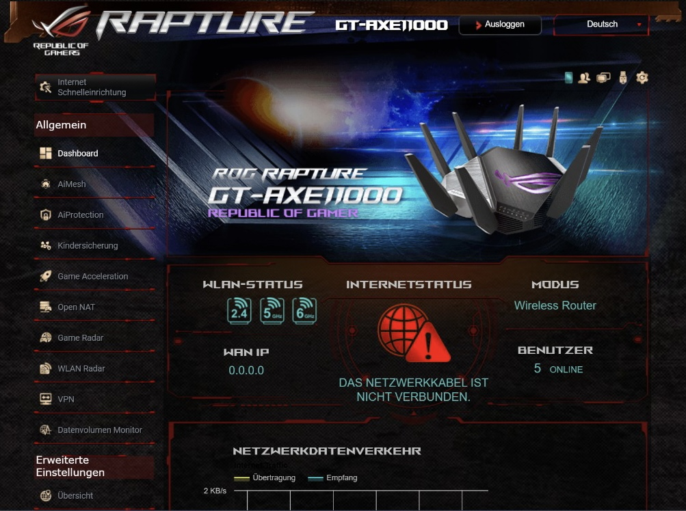
   
  Figure 1: Setting up the Router

      b. After finishing the setup of the router we were able to configure a few things.

   
  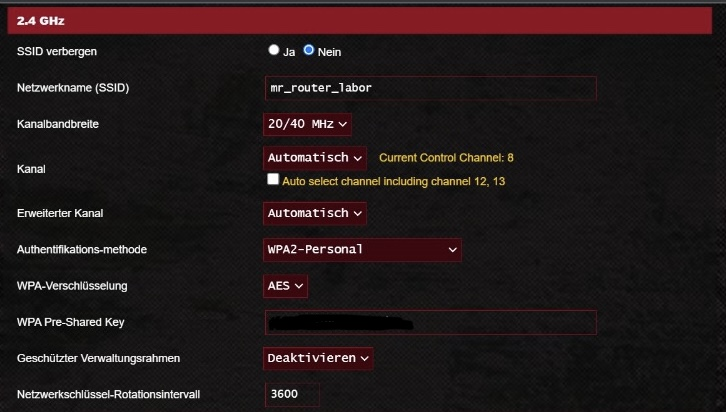
    
  Figure 2: Activating 2.4 GHz

    
  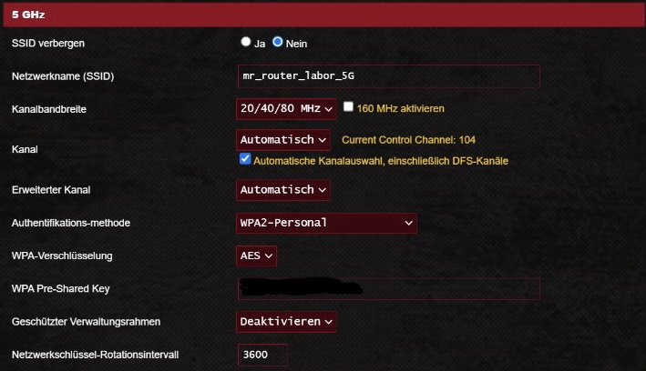
    
  Figure 3: Activating 5 GHz

    
  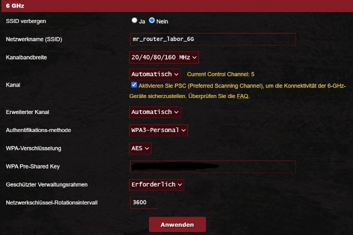
    
  Figure 4: Activating 6 GHz

2. Assigning static IP addresses to ensure an organized network structure.

    
  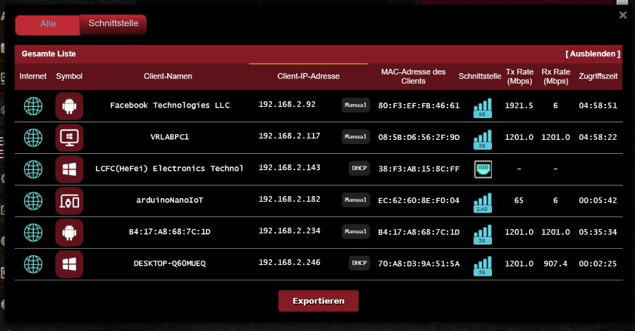
    
  Figure 5: Assigning static IP addresses

3. Verifying connectivity and data flow to ensure efficient communication.

## Passthrough Configuration

Our responsibilities extended to the intricacies of passthrough configuration, enabling users to experience real-world surroundings alongside the virtual environment. This was particularly valuable for overlaying the real environment with the display of the REBA score.

Enabling Passthrough involved steps within Unity:

1. Select "OVRCameraRig" in the "Hierarchy" tab.
2. In the "Inspector" tab, follow these stages:
   a. Choose "Stage" as the "Tracking Origin Type" under the "Tracking" section.

   
  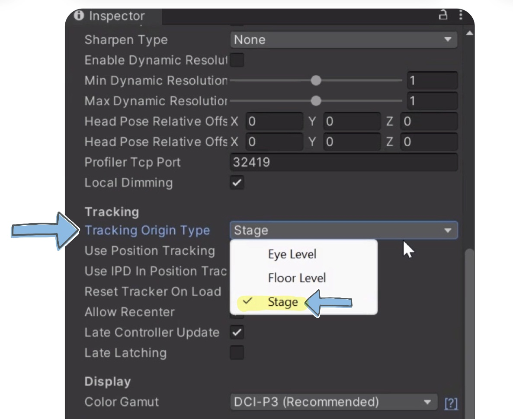
   
  Figure 6: Set Tracking Origin Type to "Stage"

   b. In the "Quest Features" section, navigate to the "General" tab. Select "Supported" from the "Passthrough Support" list.

   
  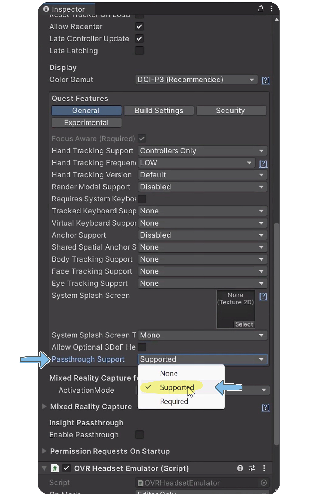
   
  Figure 7: Set Passthrough Support to "Support"

   c. Enable "Enable Passthrough" under "Insight Passthrough" for app startup.

   
  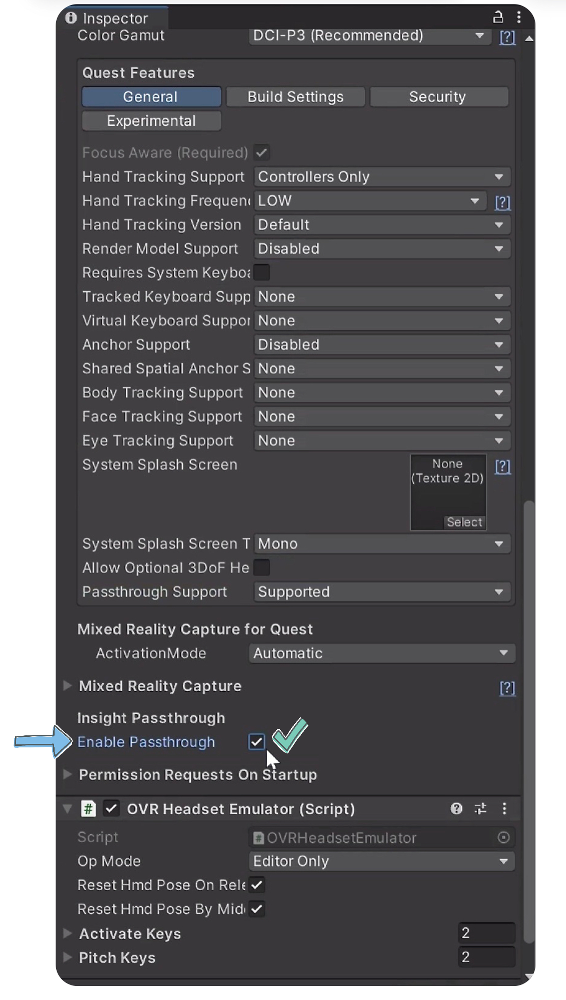
   
  Figure 8: Enable "Enable Passthrough"

   d. Integrate the "OVRPassthroughLayer" script by adding the component and selecting the script.

   
  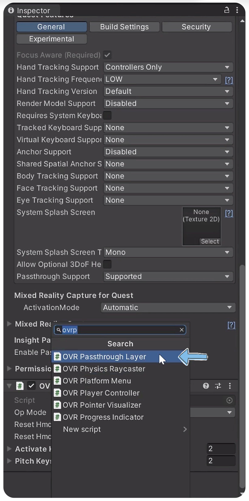
   
  Figure 9: Integrate the "OVRPassthroughLayer" script

   e. Fine-tune "OVRPassthroughLayer" settings, setting "Placement" to "Underlay" for background passthrough.

   
  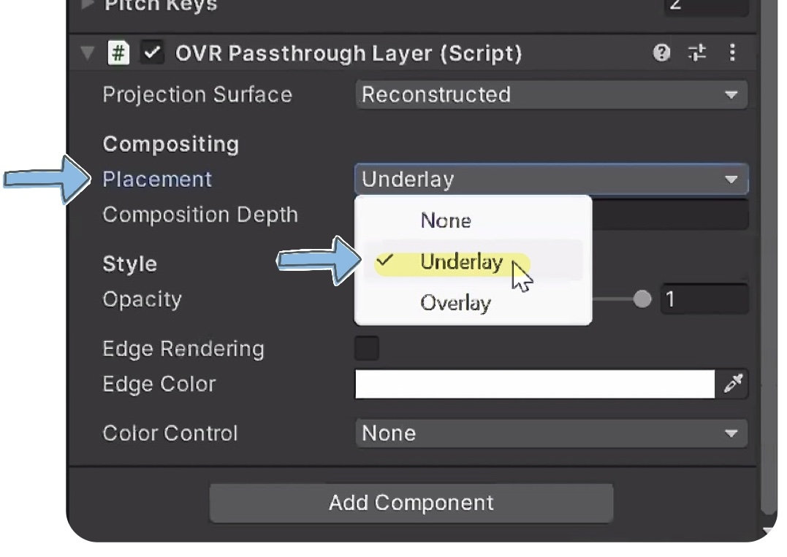
   
  Figure 10: Set "Placement" to "Underlay"

4. Access the menu, go to "Window," then select "Rendering," and finally "Lighting".

   
  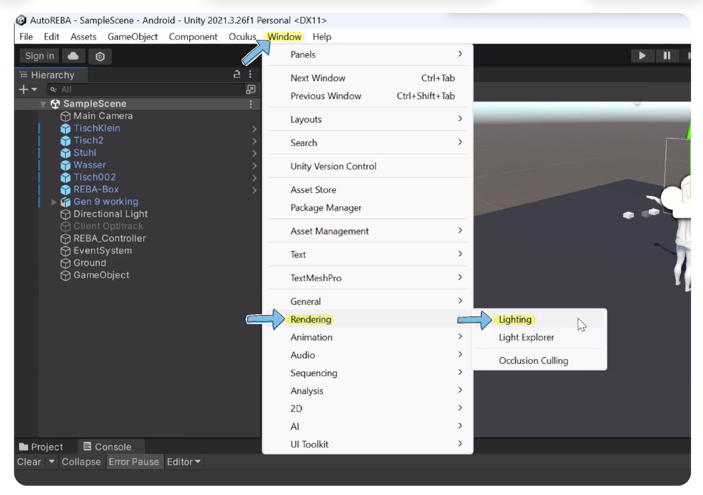
   
  Figure 11: Set Navigate to "Lighting"

5. On the "Environment" tab, locate "Skybox Material" and select "None". 

   
  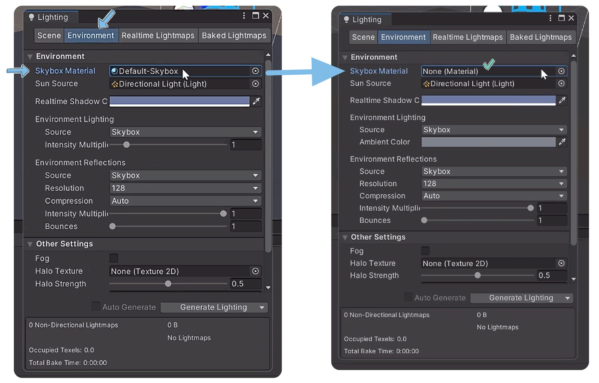
   
  Figure 12: Select "None" for "Skybox Material"

6. Expand "OVRCameraRig > TrackingSpace > CenterEyeAnchor" in the "Hierarchy" tab. In the "Inspector" tab:
   a. Choose "Solid Color" from the "Clear Flags" list.

   
  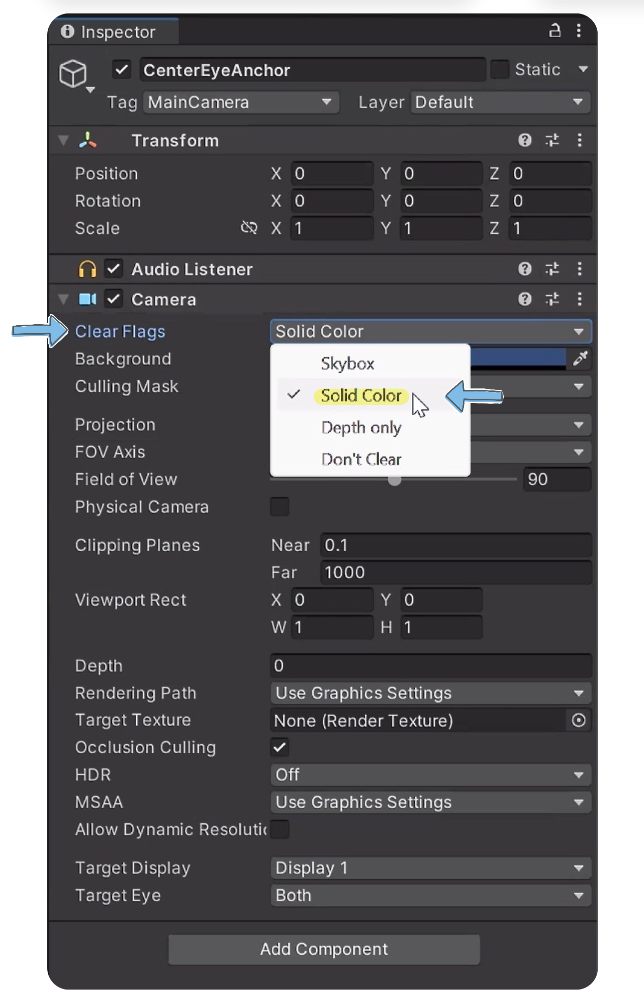
   
  Figure 13: Set "Clear Flags" to "Solid Color"

   b. Adjust the "Background color" to black and set the alpha value to 0 (or (R,G,B,A) values to (0, 0, 0, 0)).

   
  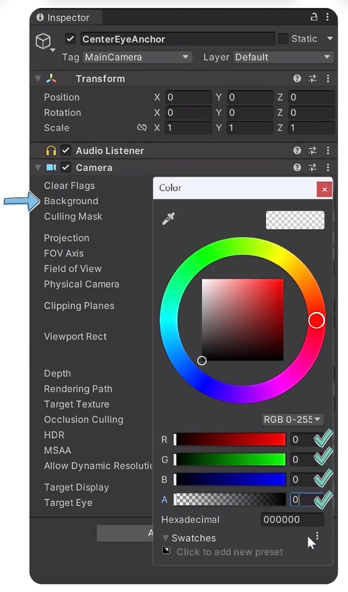
   
  Figure 14: Adjust the "Background color"

This setup empowers you to utilize passthrough while overlaying virtual 3D objects onto the physical world.

## Challenges Faced

As with any complex project, we encountered challenges. One major hurdle was integrating passthrough functionality. The discrepancy between the high-precision optical motion capture capabilities of the Motive OptiTrack system and the native tracking system of the Meta Quest Pro posed a significant challenge. These systems operate on distinct principles, demanding a creative solution.

Another significant obstacle emerged when transforming the project into a standalone .APK file for the Meta Quest Pro. Despite our commitment, compatibility issues between the systems hindered data flow. Standalone deployment limited visibility into console logs, complicating error diagnosis.

Furthermore, the usage of Air Link presented an unexpected challenge. Despite connecting the Meta Quest Pro to a 6GHz router, we encountered significant lag when using Air Link. This lag impacted the smoothness of interactions and required additional optimization efforts.

## Tracking Systems Comparison: Motive OptiTrack vs. Meta Quest Pro

### Motive OptiTrack System

**Purpose:** The Motive OptiTrack system is primarily designed for optical motion capture, offering real-time high-precision tracking of human and object movements.

**Accuracy:** It boasts exceptional positional accuracies of +/- 0.2 mm and rotational accuracies of +/- 0.1 deg.

**Skeletal Solver:** The Precision Solver estimates the pose of each bone based on measured markers, enhancing performance capture for character animation by defining skeleton movements with higher confidence.

**Active and Passive Tracking:** Motive processes data from OptiTrack cameras, using passive retroreflective markers tracked by precision cameras and Signature Pulse Active IR LEDs for error-free marker IDs and low-latency data.

**Continuous Calibration:** After setup, Motive automatically calibrates using real-time data, ensuring consistently precise tracking results.

**Integration:** It integrates seamlessly with various platforms and tools, including force plates, EMG devices, Unreal Engine, Unity, and MotionBuilder.

### Meta Quest Pro's Native Tracking

**Purpose:** The Meta Quest Pro's tracking system is designed for immersive VR experiences, offering inside-out tracking using sensors/cameras on the device.

**6DoF (Six Degrees of Freedom):** Enables free movement in virtual environments, tracking position (up/down, left/right, forward/backward) and orientation (pitch, yaw, roll).

**Guardian System:** A safety feature defining a play area; alerts users when approaching its boundaries in VR.

**Passthrough:** Uses the device's cameras to provide a black-and-white view of the real world, allowing quick environment checks without removing the headset.

### Distinction

The Motive OptiTrack and Meta Quest Pro's Native Tracking systems serve distinct purposes and offer unique functionalities:

- The Motive OptiTrack system excels in high-precision motion capture, often used in film production, research, and game development settings.
- The Meta Quest Pro's Native Tracking focuses on creating immersive VR experiences, ensuring accurate representation of user movements within virtual environments.

## Contributors:
- [Nassim Laaraj](https://github.com/Nassim795)
- [Nabil Akir](https://github.com/nabil-ak)
- [Ibtehal Al-Omari](https://github.com/ib1907)
