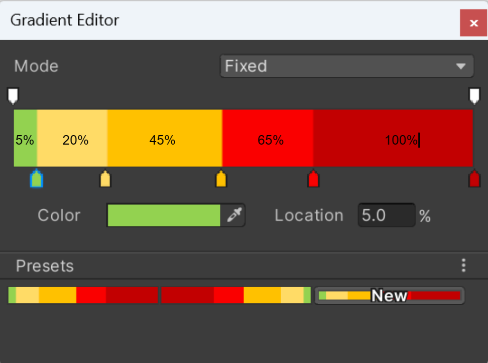
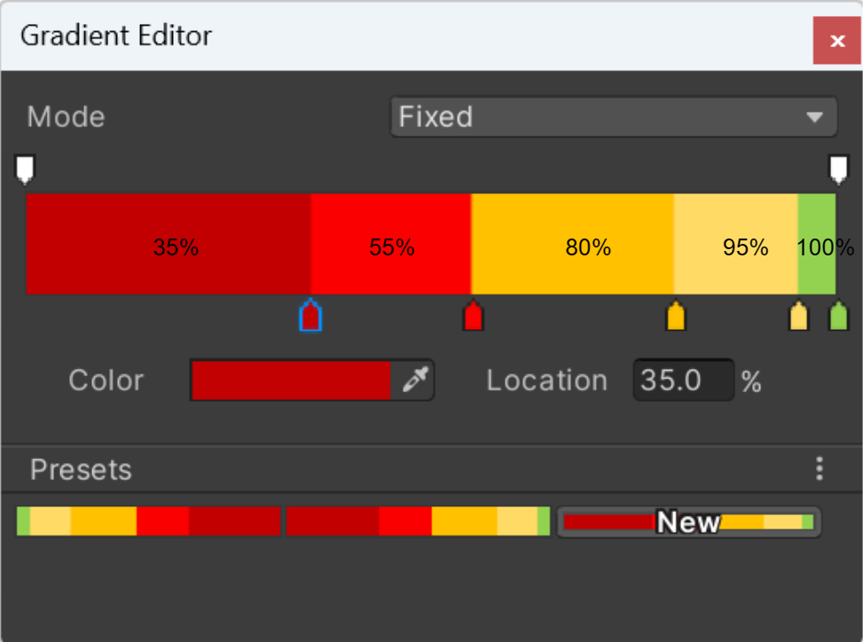
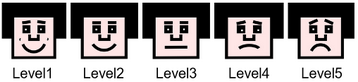
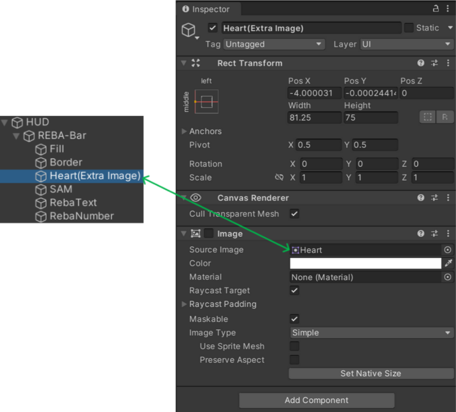
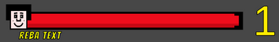
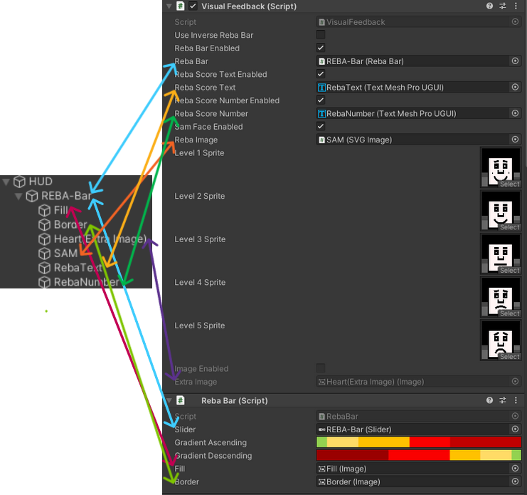

# AutoREBA - Multimodal Feedback Module

## Overview:
The AutoREBA project signifies a significant advancement in the realm of human-computer interaction, 
particularly within the mixed reality domain. The project's main objective is to enhance posture ergonomics. 
To achieve this, a Multimodal Biofeedback system is employed that provides users with immersive feedback about 
their posture based on their REBA score.

In this README, we introduce the key components of the AutoREBA system, all of which revolve around the REBA score:

- **Visual Feedback**: Dynamic visual indicators inform the user in real-time about their REBA score, providing cues about the current posture.
- **Tactile Feedback**: Using Arduino, a vibration motor is controlled which vibrates based on the user's REBA score, offering haptic feedback about the current posture.
- **Arduino Communication**: The interface between software and hardware. The Arduino controls the vibration motor based on the REBA score, providing tactile feedback.
- **Auditory Feedback**: Auditory signals, matched to the user's REBA score, inform about the posture.
## Visual Feedback
### Overview
The Multimodal Feedback module is at the heart of our approach. It facilitates seamless communication between the Arduino Nano IoT and Unity, delivering comprehensive feedback to the user through a VR headset based on their REBA score.

The visual feedback utilizes various visualizations, like the REBA-Bar and SAM faces, all of which dynamically adapt to the user's REBA score. The primary goal of these mechanisms is to provide users with an intuitive means to understand their REBA score and adjust their posture in real-time accordingly.

### Main components:
Every component in this section is intricately tied to the REBA score, ensuring dynamic, real-time feedback to the user. 
Through the Unity interface, each of these primary functions can be easily activated or deactivated, giving developers 
a high degree of flexibility in fine-tuning the user experience.
#### 1- REBA-Bar:
- **Purpose**: Represents the user's current REBA score, which can range from values 1 to 15.
- **Color Indication**: The bar's color varies with the score: The bar's color changes in accordance with the REBA score, providing instant visual feedback:
  - 1: Green (Ideal posture)
  - 2-3: Yellow
  - 4-7: Orange
  - 8-10: Red
  - 11-15: Dark Red (Poor posture)

  For a detailed breakdown of how each color fills the bar in terms of percentages, refer to Figure 1. This figure provides a comprehensive visual guide on the color distribution and settings.

   
  
   
  Figure 1: REBA-Bar Color Distribution and Percentage Fill

- **Invertible Direction**: Within Unity, there's an option to invert the direction of the REBA-Bar. This means the bar can fill in the opposite direction, offering the user a different visual representation based on their preference. Refer to Figure 2 for a visual depiction of the invertible direction.

   
  
   
  Figure 2: REBA-Bar Color Distribution and Percentage Fill

#### 2- REBA-Number & REBA-Score Text:
- **REBA-Text**: Depending on the REBA score, a pertinent message is showcased:
  - 1: "Negligible risk, no action required"
  - 2-3: "Low risk, change may be needed"
  - 4-7: "Medium risk, further investigation, change soon"
  - 8-10: "High risk, investigate and implement change"
  - 11-15: "Very high risk, implement change"
- **REBA-Number**: Depending on the REBA score, the number will change in size and color, providing an additional layer of visual feedback.
#### 3- SELF-ASSESSMENT MANIKIN (SAM):
- **Function**: SAM is a pivotal aspect of the feedback system, acting as a non-verbal rating system.
- **Rationale behind SAM**: Using universally comprehended facial expressions, SAM provides a language-agnostic approach to feedback. It conveys posture quality through facial expressions, making it accessible to a wide audience.
- **Use of SVGs**: SAM employs SVG images, ensuring that the feedback retains impeccable quality regardless of scaling or screen resolution.
- **Visual Representation**: Instead of words, SAM uses figures (manikins) to depict emotions, making it easier to understand and more engaging.
- **Faces Spectrum**: SAM encapsulates a spectrum of five unique faces, portraying emotions from very negative to very positive. Each face is associated with levels 1 (very positive) through 5 (very negative), providing clear emotional feedback based on the REBA score.
- **Integration in AutoREBA**: In the context of AutoREBA, SAM offers users an intuitive feedback mechanism regarding their posture, aiding in self-awareness and posture correction.

The SAM faces, as seen in Figure 3, range from level 1 to level 5 . This progression visually reinforces the spectrum of emotions and its relation to the user's posture feedback.

   
  
   
  Figure 3: Spectrum of SAM Faces from Level 1 (Very Positive) to Level 5 (Very Negative)

#### 4- Extra-Image:
- **Customization**: This feature provides users with the capability to incorporate their own images into the Unity scene, offering a bespoke feedback experience. As illustrated in Figure 4, users can seamlessly replace the default SAM images with their chosen visuals, thus adding a touch of personalization to the feedback mechanism.

   
  
   
  Figure 5: Final Implementation of Visual Feedback Features in Unity

 
As seen in Figure 5, the **final implementation of the REBA-Bar in Unity** reflects the described features.

   
  
   
  Figure 5: Integration of User-defined Images as an Alternative to SAM in Unity Scene

### Configuration & Usage:
After adding the "RebaBar" and "VisualFeedback" scripts to a GameObject in Unity, it's crucial to provide the necessary references in the Unity Editor.
Figure 6 illustrates the designated section within the Unity Inspector where these assignments can be made.
It's paramount to ensure that the required sprites and text references are correctly mapped as depicted in this figure.

   
  
   
  Figure 6: Unity Inspector Reference Assignments for 'RebaBar' and 'VisualFeedback' Scripts

### Dependencies:
#### 1- **Vector Graphics Version 2.0.0**:
- Vital for the impeccable rendering of SAM SVGs and the ExtraImage feature. This package is currently in its experimental phase.
- Integrate using the identifier [com.unity.vectorgraphics](https://docs.unity3d.com/Packages/com.unity.vectorgraphics@2.0/manual/index.html).
#### 2- **TextMeshPro 3.0.6**:
- A sophisticated text solution tailored for Unity. It seamlessly replaces Unity's UI Text and the legacy Text Mesh.
- Integral in our module for the RebaText and RebaNumber elements.

## Tactile Feedback Feedback
text

## Arduino Communication
text

## Auditory Feedback
text
