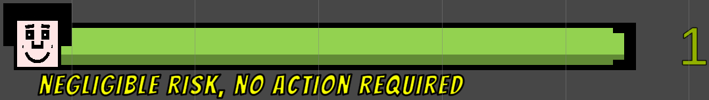
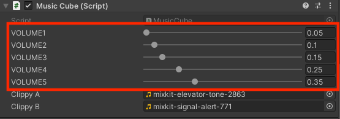

# AutoREBA - Multimodal Feedback Module

## Overview:
The AutoREBA project signifies a significant advancement in the realm of human-computer interaction, 
particularly within the mixed reality domain. The project's main objective is to enhance posture ergonomics. 
To achieve this, a Multimodal Biofeedback system is employed that provides users with immersive feedback about 
their posture based on their REBA score.

In this README, we introduce the key components of the AutoREBA system, all of which revolve around the REBA score:

- **Visual Feedback**: Dynamic visual indicators inform the user in real-time about their REBA score, providing cues about the current posture.
- **Tactile Feedback**: Using Arduino, a vibration motor is controlled which vibrates based on the user's REBA score, offering haptic feedback about the current posture.
- **Arduino Communication**: The interface between software and hardware. The Arduino controls the vibration motor based on the REBA score, providing tactile feedback.
- **Auditory Feedback**: Auditory signals, matched to the user's REBA score, inform about the posture.
## Visual Feedback
### Overview
The Multimodal Feedback module is at the heart of our approach. It facilitates seamless communication between the Arduino Nano IoT and Unity, delivering comprehensive feedback to the user through a VR headset based on their REBA score.

The visual feedback utilizes various visualizations, like the REBA-Bar and SAM faces, all of which dynamically adapt to the user's REBA score. The primary goal of these mechanisms is to provide users with an intuitive means to understand their REBA score and adjust their posture in real-time accordingly.

### Main components:
Every component in this section is intricately tied to the REBA score, ensuring dynamic, real-time feedback to the user. 
Through the Unity interface, each of these primary functions can be easily activated or deactivated, giving developers 
a high degree of flexibility in fine-tuning the user experience.
#### 1- REBA-Bar:
- **Purpose**: Represents the user's current REBA score, which can range from values 1 to 15.
- **Color Indication**: The bar's color varies with the score: The bar's color changes in accordance with the REBA score, providing instant visual feedback:
  - 1: Green (Ideal posture)
  - 2-3: Yellow
  - 4-7: Orange
  - 8-10: Red
  - 11-15: Dark Red (Poor posture)

  For a detailed breakdown of how each color fills the bar in terms of percentages, refer to Figure 1. This figure provides a comprehensive visual guide on the color distribution and settings.

   
  
   
  Figure 1: REBA-Bar Color Distribution and Percentage Fill

- **Invertible Direction**: Within Unity, there's an option to invert the direction of the REBA-Bar. This means the bar can fill in the opposite direction, offering the user a different visual representation based on their preference. Refer to Figure 2 for a visual depiction of the invertible direction.

   
  
   
  Figure 2: REBA-Bar Color Distribution and Percentage Fill

#### 2- REBA-Number & REBA-Score Text:
- **REBA-Text**: Depending on the REBA score, a pertinent message is showcased:
  - 1: "Negligible risk, no action required"
  - 2-3: "Low risk, change may be needed"
  - 4-7: "Medium risk, further investigation, change soon"
  - 8-10: "High risk, investigate and implement change"
  - 11-15: "Very high risk, implement change"
- **REBA-Number**: Depending on the REBA score, the number will change in size and color, providing an additional layer of visual feedback.
#### 3- SELF-ASSESSMENT MANIKIN (SAM):
- **Function**: SAM is a pivotal aspect of the feedback system, acting as a non-verbal rating system.
- **Rationale behind SAM**: Using universally comprehended facial expressions, SAM provides a language-agnostic approach to feedback. It conveys posture quality through facial expressions, making it accessible to a wide audience.
- **Use of SVGs**: SAM employs SVG images, ensuring that the feedback retains impeccable quality regardless of scaling or screen resolution.
- **Visual Representation**: Instead of words, SAM uses figures (manikins) to depict emotions, making it easier to understand and more engaging.
- **Faces Spectrum**: SAM encapsulates a spectrum of five unique faces, portraying emotions from very negative to very positive. Each face is associated with levels 1 (very positive) through 5 (very negative), providing clear emotional feedback based on the REBA score.
- **Integration in AutoREBA**: In the context of AutoREBA, SAM offers users an intuitive feedback mechanism regarding their posture, aiding in self-awareness and posture correction.

The SAM faces, as seen in Figure 3, range from level 1 to level 5 . This progression visually reinforces the spectrum of emotions and its relation to the user's posture feedback.

   
  
   
  Figure 3: Spectrum of SAM Faces from Level 1 (Very Positive) to Level 5 (Very Negative)

#### 4- Extra-Image:
- **Customization**: This feature provides users with the capability to incorporate their own images into the Unity scene, offering a bespoke feedback experience. As illustrated in Figure 4, users can seamlessly replace the default SAM images with their chosen visuals, thus adding a touch of personalization to the feedback mechanism.

   
  
   
  Figure 5: Final Implementation of Visual Feedback Features in Unity

 
As seen in Figure 5, the **final implementation of the REBA-Bar in Unity** reflects the described features.

   
  
   
  Figure 5: Integration of User-defined Images as an Alternative to SAM in Unity Scene

### Configuration & Usage:
After adding the "RebaBar" and "VisualFeedback" scripts to a GameObject in Unity, it's crucial to provide the necessary references in the Unity Editor.
Figure 6 illustrates the designated section within the Unity Inspector where these assignments can be made.
It's paramount to ensure that the required sprites and text references are correctly mapped as depicted in this figure.

   
  
   
  Figure 6: Unity Inspector Reference Assignments for 'RebaBar' and 'VisualFeedback' Scripts

### Dependencies:
#### 1- **Vector Graphics Version 2.0.0**:
- Vital for the impeccable rendering of SAM SVGs and the ExtraImage feature. This package is currently in its experimental phase.
- Integrate using the identifier [com.unity.vectorgraphics](https://docs.unity3d.com/Packages/com.unity.vectorgraphics@2.0/manual/index.html).
#### 2- **TextMeshPro 3.0.6**:
- A sophisticated text solution tailored for Unity. It seamlessly replaces Unity's UI Text and the legacy Text Mesh.
- Integral in our module for the RebaText and RebaNumber elements.

## Tactile Feedback
### Electrical pulses: 
In the phase of developing tactile feedback through electrical pulses, we conducted an internal study using ourselves as test subjects. We tested electromyostimulation (EMS) on different muscle parts to find the optimal position for impulse delivery.

This study proved to be more time-consuming than expected, as finding the exact muscle area where the EMS pulse was most effective was complicated. In addition, we found that the electrical pulses could be painful in some cases.

These two main findings - the time-consuming process of finding the right muscle area and the potentially uncomfortable feeling of the pulses - led us to decide to discard this method altogether. Despite the initial expectation that electrical pulses could provide effective tactile feedback, we found them to be off target. The challenges outweighed the potential benefits, and so we decided to focus solely on vibration in our tactile feedback. This approach seemed more suitable for us to convey the desired information about posture in a pleasant and efficient way.

### Vibration
We used “Arduinos Nano 33 IoT” as controllers for vibration motors. These can be connected to vibrationmotors via pins to precisely control their vibration.

The “Arduinos Nano IoT” were integrated into our Wi-Fi network, using the same network connection as the central computer. This integration allowed direct communication between the computer and the Arduinos.

When a vibration was to be triggered, the computer would send a specific command. This command was then sent to the Arduinos via the WLAN network using the UDP protocol (User Datagram Protocol). 

Once the Arduinos received the UDP command, they interpreted the information and passed it on to the vibrationmotors via the appropriate pins. The motors were then activated, controlling the strength and duration of the vibration according to the command received.

### Vibrationmotors
vibrationmotors of the type "Iduino TC-9520268" were used in the project. These vibration motors are controlled via pins, whereby each motor has three specific pins:
1.	G: Ground connection (earthing)
2.	V: Supply voltage (supplied voltage, between 3.0 V and 5.2 V)
3.	S: Control signal (control)
   
These three pins must each be connected to the corresponding pins of the Arduino, using breadboard cables to connect them.

The vibration motors can be controlled with different strengths in the range from 0 to 255, where 0 is off and 255 is the highest vibration strength However, there are special characteristics:
- Minimum voltage range (0 to 89): This range provides so little voltage that the motor will not work even with higher voltage starting.
- Low voltage range (90 to 129): In this range, the engine may not start due to insufficient voltage. To counteract this, the motor must first be started with a higher voltage before it can run with a lower strength.
- Sufficient voltage range (130 to 255): The motor runs without problems here.
  
The vibration motors are designed to run between 3.0 V and 5.2 V, but they show significant differences in their vibration intensity at the same drive strength (in the range of 90 to 255) and different voltages. The higher the voltage, the more intense the vibration. For this reason, it is recommended to use a higher voltage to allow greater choice and control over the vibration intensity.

The vibration motors can only be controlled differently in their intensity by the Arduinos if the connected pin is marked with the tilde symbol "~". This symbol means that the pin supports pulse width modulation (PWM). Pins without this PWM support are not able to vary the vibration intensity; they can only switch the motor on or off without allowing intermediate levels of intensity.

### Arduino Communication
For our project we chose the Arduino Nano 33 IoT. This Arduino was chosen because it is small, compact, easy to attach and additionally enables WIFI connections. This WIFI function facilitates communication between the computer and the VR goggles.

Although the Arduino only supports a power supply of 3.3 V by default, a pin called "VUSB" offers the possibility to solder the two contacts there. This enables a 5 V power supply for the vibration motors. More information under this link (retrieved on 09.08.2023 at 14:00).

To run the code "udpClientWlan" on the Arduino, the package "WIFININA" from the library must first be installed and integrated in the Arduino IDE. The code itself starts with the integration of the necessary libraries (SPI.h and WiFiNINA.h) for the SPI and WiFi functionalities, as well as the declaration of constants and variables for LED pins, motor pins, UDP port and WiFi details. Within the code, the SSID and password of the WLAN to which the Arduino is to connect are also specified. If there are any variations in SSID or password, these must be adjusted accordingly in the code.

In the setup function, the serial communication is initialised, the pins are defined as outputs and the WiFi connection is established with the specified access data. In addition, UDP is started on the specified port.

The main logic is found in the function "vibrationMotors", which is called in the loop method. This checks incoming UDP packets and performs actions based on the commands received. The motor controller analyses commands to start vibration or calibration and sends corresponding signals to the vibration motors. The strength of the vibration is derived from the packet data, and if the strength is between 0 and 130, a special start-up procedure is initiated to crank the motors. The vibration duration is 1 second for normal messages and 2 seconds for calibration messages.

There are specific functions for managing the WiFi connection, such as connecting to a WiFi network and outputting network information. When an attempt is made to establish a connection, the LED flashes, while a successful connection is indicated by a permanently lit LED signal.

### Vibration as feedback for the Reba score
Initially, it seemed reasonable to use a vibrationmotor that starts with the lowest possible vibration value (90) and increases in even steps to the highest value (255). However, we found out:
- Perception of smaller vibrations: The differences between lower vibration levels can be perceived more clearly than with higher ones. Therefore, an exponential mapping seemed more appropriate.
- Individual sensitivity: Since everyone perceives vibration differently, we had to consider that different mappings might be needed to adjust the intensity of the vibration individually - some people might find a stronger, others a weaker vibration suitable.
- Insufficient differences in the mappings: Despite several mappings, the differences were sometimes not clear enough, so we decided to enable the option of another vibrationmotor so that more variation is possible.

To find the optimal feedback, there is the possibility to test them beforehand by using the script "Vib_Vibration". See different mappings. (LINK)
The feedback system "Vibration" in our project is divided into two separate scripts:
1.	Vibration
2.	Vib_calibration

Both scripts must be attached to a “GameObject” in Unity before they can be used. They each offer three selectable options, which are described below:
1.	Motor slider: this allows you to specify whether one or two vibration motors should be used.
2.	Steps Slider: This option allows the user to decide whether the vibration should follow Reba values between 1 and 15 or alternatively be divided into five fixed values, depending on the danger level.

 

   
  
   
  Figure 7: RebaScore and Level of MSD Risk

3.	Intensity Slider: The user can choose between three intensity levels (Low, Medium, High) to adjust the vibration intensity.

 

   
  
   
  Figure 8: Vibration-Skript on Unity

 
In both scripts, the IP address of the Arduino and the port number are first set in the code to enable communication with the device.
- Script Vibration: This script reads the Reba Score from the script "REBA_Score" and sends the command "Start Vibration" to the Arduino every second, the strength varying depending on the mapping. This creates a continuous vibration that can change every second. The timing and vibration duration can be adjusted in Unity and in the Arduino code (delay(970)) to allow faster or slower changes. 
- Script Vib_Calibration: With this script, the Reba Score can be set and tested directly in Unity Inspector to find the appropriate mapping. Depending on the mapping, the selected strengths are sent to the Arduino with the command "Start Calibration" as soon as you click on the button "Test Vibration" in the Inspector. The vibration lasts for 2 seconds.

 

   
  
   
  Figure 9: Calibration-Skript on Unity

### Router
We used the router "ASUS GT-AXE11000" for our project. It is advisable to set the IP addresses of the Arduinos in the router settings as they are specified in the Unity scripts.

 

   
  
   
  Figure 10: Example of setting IP addresses static on "ASUS GT-AXE11000"

## Auditory Feedback
### Overview
The auditory feedback is used to support posture correction by actively and quickly drawing attention based on different auditory notifications.  It aims to create awareness of the user's posture by notifying the user in real time and correcting the posture.  The sound itself, which is played in different patterns, is intended to encourage the user to improve his bad position and thereby create a progressive improvement of posture in VR over time.  The auditory feedback is close to the body and is played by the sound of the headset, which cannot be ignored by the user.  The feedback itself is played in different variations in order to establish connections to the level of the REBA score based on different patterns, so that the user knows directly about the severity of his posture.
The sound allows a multitasking to the visual and brings a direct feedback that cannot be ignored or ignored as with the visual.  Thus, despite distraction, feedback can be sent and attention drawn to the posture.
Repeated loud messages about a dominant in poor posture can not be ignored, and the user is encouraged to improve his posture in order to stop or improve the sound.  The sound unconsciously reminds the user of a warning system, whereby the alarm indicates an imminent danger, whereby the attitude in this connection is classified as a danger or risk for the user unconsciously.  Tone, rhythm and sound are an important part of the transmission of information that is subconsciously associated with certain emotions, such as danger or risk, with an alarm sound or louder dominant sound.
The unpleasant and loud sound should create a conscious attitude.  The communication via a loud and dominant unpleasant sound should bring the user an unpleasant connection with the posture Sodas the posture is corrected quickly, because the user wants to stop the sound as soon as possible.
The auditory feedback serves as a memory support and learning environment whereby the user is actively supported in the learning process in relation to the posture by means of an immediate feedback about their actions.
After each correction, the user learns to improve his posture in the long term by means of a reward over the sound, by a change for the better.  Here, the reward as well as the correction by the sound is better remembered, since sound is a strong indicator.  The reward system will remind the user of his/her attitude in the long-term process by means of a consistent alarm sound, to remind him/her of the risky attitude and sensitize him/her to the formation of a habit based on the emotional and communicative effect of the sound in the memory of the user, since he/she learns to pay more attention to his/her attitude.

### Main components:
The auditory feedback works with the REBA score and varies depending on the level of the score.  Feedback takes place in real-time to the user via the VR headset.  The REBA scores are divided into 5 different levels, so that there are 5 different sounds available and are played depending on the respective level.

#### 1- REBA - Level:
The REBA scores range over 5 levels which define the degree of incorrect posture, as can be seen from the table.

   
  
   
  Figure 11: REBA score level

Source : Ergo Plus, https://ergo-plus.com/reba-assessment-tool-guide/, 10.08.2023

#### 2- Volume - Level:
The volume of the REBA score corresponds to the respective level and can be precisely adjusted via the Inspector via Unity, so that the user can adjust the volume for themselves.  The volume can be adjusted from 0.1 to 1, whereby a volume of 0.2 is recommended.

**Volume Level 1  (REBA Score 1 ideal posture):** play elevator sound one time 
**Volume Level 2 (REBA Score 2-3):** play elevator sound two times
**Volume Level 3 (REBA Score 4-7):** play elevator sound three times 
**Volume Level 4 (REBA Score 8-10):** play alert sound one time 
**Volume Level 5 (REBA Score 11+ poor posture):** play alert sound in loop

   
  
   
  Figure 12: Volume levels on Unity

The auditory feedback uses 2 different sounds and plays them in different repetitions.  The volume can also be adjusted using the controls, so that the user has the opportunity to adjust it individually, whether all should have the same volume or would correspond differently.

### Configuration & Usage:
#### Upload Files 
The MusicCube.cs script and both music files must be added to your chosen project.  The script is inserted to the respective selected GameObject in Unity and the audios are classified into the assets.  Both files are needed to play the audio.

   
  
   
  Figure 13: setClippy on Unity

#### Music GameObject Settings
To be able to use the music clips, they must be saved as a clip in the object by assigning the sound “elevator” to “Clippy A” and the sound “alert” to “Clippy B”, so that the script can also use them. 
Here, the sound clips can also be individualized and adapted according to your own ideas, by assigning them to the respective clip.
The assignment of the audios depends on the scheme, „Clippy A“ is used for the audio volume levels 1-3 and Clippy B for the audio levels 4+5, with note that at volume level 5 the sound is played as a loop.
In addition, 3 audio sources must be added to your GameObject, so that the script can play the repetitions without any problems.

   
  
   
  Figure 14: addAudioSource on Unity

____________________________________________________
## Contributors:
- [Patricia Maria Bombik](http://github.com/PatPatDango)
- [Albin Hoti](http://github.com/albinh55)
- [Pouya Nikbakhsh](http://github.com/pouya-nik)
